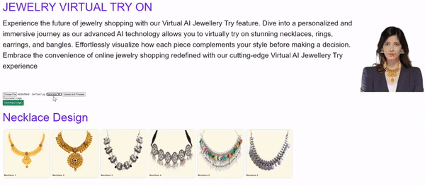

# 💍 Virtual Try-On for Jewelry  
*🚀 Transforming Online Jewelry Shopping with AI & Augmented Reality* ✨

[](https://www.python.org/)  
[](https://pjreddie.com/darknet/yolo/)  
[](https://opencv.org/)

> **Virtual Try-On for Jewelry** 💎 is an AI-powered project that enables users to virtually try on earrings, necklaces, rings, and other jewelry pieces. This innovative solution enhances the online jewelry shopping experience, allowing customers to see how pieces look before purchasing. 🛍️

---

## 📌 Table of Contents

- [✨ Overview](#overview)
- [🎯 Features](#features)
- [📽️ Demo](#demo)
- [🛠 Technologies Used](#technologies-used)
- [⚙️ Installation & Setup](#installation--setup)
- [🚀 Usage](#usage)
- [📓 YOLO Training Notebook](#yolo-training-notebook)
- [📊 Presentation](#presentation)
- [🔮 Future Enhancements](#future-enhancements)
- [🤝 Contributing](#contributing)
- [📜 License](#license)
- [📬 Contact](#contact)

---

## ✨ Overview

In the digital era, shopping for jewelry online can be challenging without seeing how it looks when worn. **Virtual Try-On for Jewelry** solves this problem by leveraging computer vision and deep learning. The project demonstrates:

- **🎯 Real-Time Jewelry Detection:** Using a custom-trained YOLO model to detect jewelry pieces.
- **💻 Interactive Web Application:** Allows users to upload their photos or use a webcam for a virtual try-on.
- **🔗 End-to-End AI Pipeline:** Includes model training and a web-based demonstration.

---

## 🎯 Features

- **✅ Accurate Jewelry Detection:** Uses YOLO for precise object detection.
- **🖥️ User-Friendly Interface:** Easy-to-use web app built with Python.
- **⚡ Real-Time Virtual Try-On:** Overlay earrings, necklaces, rings, and more in real time.
- **🛠️ Modular Codebase:** Clean and well-structured for future improvements.
- **📽️ Demonstrative Assets:** GIFs and a presentation (Ppt.pdf) included.

---

## 📽️ Demo

Check out a preview of how the Virtual Try-On works:

  
*🎬 An animated demo showcasing the jewelry try-on feature.*

Alternatively, check out this additional demonstration:


---

## 🛠 Technologies Used

- **🐍 Python:** The core programming language.
- **🦾 YOLO:** Detects and segments jewelry items.
- **📓 Jupyter Notebook:** For training and fine-tuning the YOLO model (`YOLO_TRAINING.ipynb`).
- **🌐 Flask (or similar frameworks):** Runs the web application (`app.py`).
- **📷 OpenCV:** Image processing and real-time computer vision.

---

## ⚙️ Installation & Setup

Follow these steps to get started:

1. **🔽 Clone the Repository:**

   ```bash
   git clone https://github.com/pranjaykumar926/VIRTUAL-TRY-ON.git
   cd VIRTUAL-TRY-ON
   ```

2. **🛠 Create a Virtual Environment (Optional but Recommended):**

   ```bash
   python -m venv venv
   source venv/bin/activate  # On Windows use `venv\Scripts\activate`
   ```

3. **📦 Install Dependencies:**

   ```bash
   pip install -r requirements.txt
   ```

4. **📥 Download Pre-trained Weights (if applicable):**

   Follow the instructions in `YOLO_TRAINING.ipynb` to get model weights.

---

## 🚀 Usage

To launch the web application demo:

1. **▶️ Run the Application:**

   ```bash
   python app.py
   ```

2. **🌐 Open Your Browser:**

   Navigate to `http://localhost:5000` to try on jewelry virtually.

---

## 📓 YOLO Training Notebook

The `YOLO_TRAINING.ipynb` notebook includes:

- 🛠 Data preprocessing and augmentation
- 🎯 YOLO model training configuration
- 📈 Model evaluation steps

---

## 📊 Presentation

For an in-depth project explanation, check out [Ppt.pdf](Ppt.pdf). 📂

---

## 🔮 Future Enhancements

- **🎯 Improved Jewelry Detection:** Train on more diverse jewelry datasets.
- **🕶️ Augmented Reality (AR):** Enhance the try-on experience with live tracking.
- **📱 Mobile Compatibility:** Optimize for smartphones and tablets.
- **📏 Personalized Recommendations:** AI-based jewelry recommendations.

---

## 🤝 Contributing

Contributions are welcome! To contribute:

1. Fork the repository.
2. Create a new branch (`feature/your-feature`).
3. Commit your changes.
4. Open a pull request. ✅

---

## 📜 License

*This project is currently not licensed. Contact the repository owner for permissions.*

---

## 📬 Contact

For inquiries or collaborations, reach out:

- **GitHub:** [pranjaykumar926](https://github.com/pranjaykumar926) 🏗️
- **📧 Email:** *[pranjaykumar926@gmail.com](mailto:pranjaykumar926@gmail.com)* 📩

---

✨ *Revolutionizing jewelry shopping with AI-powered Virtual Try-On!* 💍🚀

